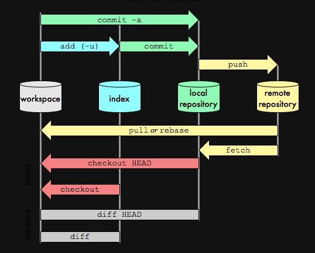
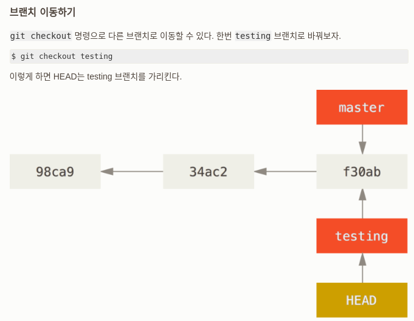

# Table of Contents

1.  [Vi mode (default control)](#org08f2427)
2.  [Windows (spc w)](#org7fa13aa)
3.  [work space (spc TAB)](#org0f6d3b6)
4.  [Buffer (spc b)](#org22efda9)
5.  [Dired mode(spc .)](#org4187685)
6.  [Command(M x or spc :)](#org79fe512)
7.  [magit (spc g)](#org6bf8ff5)
    1.  [basic command](#org85c193a)
    2.  [시작(remote-repository를 local에 복사, git clone)](#org9317bb9)
    3.  [시작( local을 remote-repository에 복사, git init)](#orgb13c55c)
    4.  [staging(git add)](#orgeab0018)
    5.  [commit(git commit -m)](#org62e0140)
    6.  [push(git push)](#org7e598b8)
8.  [org mode](#orgd00c102)

# Vi mode (default control)

<table border="2" cellspacing="0" cellpadding="6" rules="groups" frame="hsides">

<colgroup>
<col  class="org-left" />

<col  class="org-left" />

<col  class="org-left" />

<col  class="org-left" />
</colgroup>
<thead>
<tr>
<th scope="col" class="org-left">esc</th>
<th scope="col" class="org-left">i</th>
<th scope="col" class="org-left">v</th>
<th scope="col" class="org-left">:</th>
</tr>
</thead>

<tbody>
<tr>
<td class="org-left">default 상태</td>
<td class="org-left">입력모드</td>
<td class="org-left">선택모드</td>
<td class="org-left">명령어모드</td>
</tr>

<tr>
<td class="org-left">l(or right) 한 칸 이동</td>
<td class="org-left">키보드 입력</td>
<td class="org-left">esc와 동일</td>
<td class="org-left">:w 저장</td>
</tr>

<tr>
<td class="org-left">h(or left) 한 칸 뒤로 이동</td>
<td class="org-left">&#xa0;</td>
<td class="org-left">esc와 동일</td>
<td class="org-left">:q 끝내기</td>
</tr>

<tr>
<td class="org-left">j(or down) 아래로 한 줄 이동</td>
<td class="org-left">&#xa0;</td>
<td class="org-left">esc와 동일</td>
<td class="org-left">:wq or :x 저장 후 끝내기</td>
</tr>

<tr>
<td class="org-left">k(or up) 위로 한 줄 이동</td>
<td class="org-left">&#xa0;</td>
<td class="org-left">esc와 동일</td>
<td class="org-left">:q! 강제 종료</td>
</tr>

<tr>
<td class="org-left">w(or e) 한 단어 앞으로 이동</td>
<td class="org-left">&#xa0;</td>
<td class="org-left">esc와 동일</td>
<td class="org-left">:w /path/file_name 다른이름으로 저장</td>
</tr>

<tr>
<td class="org-left">b 한 단어 뒤로 이동</td>
<td class="org-left">&#xa0;</td>
<td class="org-left">esc와 동일</td>
<td class="org-left">&#xa0;</td>
</tr>

<tr>
<td class="org-left">) 한 문장 앞으로 이동</td>
<td class="org-left">&#xa0;</td>
<td class="org-left">esc와 동일</td>
<td class="org-left">&#xa0;</td>
</tr>

<tr>
<td class="org-left">} 한 문단 앞으로 이동</td>
<td class="org-left">&#xa0;</td>
<td class="org-left">esc와 동일</td>
<td class="org-left">&#xa0;</td>
</tr>

<tr>
<td class="org-left">y 선택영역 복사</td>
<td class="org-left">&#xa0;</td>
<td class="org-left">esc와 동일</td>
<td class="org-left">&#xa0;</td>
</tr>

<tr>
<td class="org-left">yy 한 줄 복사</td>
<td class="org-left">&#xa0;</td>
<td class="org-left">yy 없음</td>
<td class="org-left">&#xa0;</td>
</tr>

<tr>
<td class="org-left">p 붙여넣기</td>
<td class="org-left">&#xa0;</td>
<td class="org-left">esc와 동일</td>
<td class="org-left">&#xa0;</td>
</tr>

<tr>
<td class="org-left">d 선택영역 잘라내기</td>
<td class="org-left">&#xa0;</td>
<td class="org-left">esc와 동일</td>
<td class="org-left">&#xa0;</td>
</tr>

<tr>
<td class="org-left">dd 한 줄 잘라내기</td>
<td class="org-left">&#xa0;</td>
<td class="org-left">dd 없음</td>
<td class="org-left">&#xa0;</td>
</tr>

<tr>
<td class="org-left">u 실행 취소(undo)</td>
<td class="org-left">&#xa0;</td>
<td class="org-left">esc와 동일</td>
<td class="org-left">&#xa0;</td>
</tr>

<tr>
<td class="org-left">ctrl-r 다시 실행(redo)</td>
<td class="org-left">&#xa0;</td>
<td class="org-left">esc와 동일</td>
<td class="org-left">&#xa0;</td>
</tr>

<tr>
<td class="org-left">ctrl-h t 테마설정(nova)</td>
<td class="org-left">&#xa0;</td>
<td class="org-left">&#xa0;</td>
<td class="org-left">&#xa0;</td>
</tr>
</tbody>
</table>

# Windows (spc w)

<table border="2" cellspacing="0" cellpadding="6" rules="groups" frame="hsides">

<colgroup>
<col  class="org-left" />

<col  class="org-left" />

<col  class="org-left" />

<col  class="org-left" />

<col  class="org-left" />

<col  class="org-left" />

<col  class="org-left" />

<col  class="org-left" />

<col  class="org-left" />
</colgroup>
<tbody>
<tr>
<td class="org-left">새로 생성</td>
<td class="org-left">s</td>
<td class="org-left">v</td>
<td class="org-left">n</td>
<td class="org-left">&#xa0;</td>
<td class="org-left">&#xa0;</td>
<td class="org-left">&#xa0;</td>
<td class="org-left">&#xa0;</td>
<td class="org-left">&#xa0;</td>
</tr>

<tr>
<td class="org-left">창 이동</td>
<td class="org-left">h</td>
<td class="org-left">j</td>
<td class="org-left">k</td>
<td class="org-left">l</td>
<td class="org-left">b</td>
<td class="org-left">t</td>
<td class="org-left">r</td>
<td class="org-left">R</td>
</tr>

<tr>
<td class="org-left">배열 변경</td>
<td class="org-left">H</td>
<td class="org-left">J</td>
<td class="org-left">K</td>
<td class="org-left">L</td>
<td class="org-left">&#xa0;</td>
<td class="org-left">&#xa0;</td>
<td class="org-left">&#xa0;</td>
<td class="org-left">&#xa0;</td>
</tr>

<tr>
<td class="org-left">크기 조정</td>
<td class="org-left">=</td>
<td class="org-left">_</td>
<td class="org-left">shift-\</td>
<td class="org-left">o</td>
<td class="org-left">&#xa0;</td>
<td class="org-left">&#xa0;</td>
<td class="org-left">&#xa0;</td>
<td class="org-left">&#xa0;</td>
</tr>

<tr>
<td class="org-left">창 닫기</td>
<td class="org-left">c</td>
<td class="org-left">d</td>
<td class="org-left">q</td>
<td class="org-left">&#xa0;</td>
<td class="org-left">&#xa0;</td>
<td class="org-left">&#xa0;</td>
<td class="org-left">&#xa0;</td>
<td class="org-left">&#xa0;</td>
</tr>
</tbody>
</table>

# work space (spc TAB)

# Buffer (spc b)

<table border="2" cellspacing="0" cellpadding="6" rules="groups" frame="hsides">

<colgroup>
<col  class="org-left" />

<col  class="org-left" />

<col  class="org-left" />

<col  class="org-left" />

<col  class="org-left" />

<col  class="org-left" />
</colgroup>
<tbody>
<tr>
<td class="org-left">버퍼이동</td>
<td class="org-left">[ or p</td>
<td class="org-left">] or n</td>
<td class="org-left">b 목록에서 선택</td>
<td class="org-left">B b의 확장판</td>
<td class="org-left">l 마지막 버퍼</td>
</tr>

<tr>
<td class="org-left">버퍼생성/킬</td>
<td class="org-left">C 새창에 복사</td>
<td class="org-left">d 현재 버퍼 킬</td>
<td class="org-left">K 모든 버퍼 킬</td>
<td class="org-left">O 현재 버퍼 제외 올 킬</td>
<td class="org-left">s 현재 버퍼 저장</td>
</tr>

<tr>
<td class="org-left">spc b i (목록)</td>
<td class="org-left">m 마크</td>
<td class="org-left">u 언마크</td>
<td class="org-left">t 모든 버퍼 마크</td>
<td class="org-left">D  선택된 버퍼 킬</td>
<td class="org-left">q 나가기</td>
</tr>
</tbody>
</table>

# Dired mode(spc .)

<table border="2" cellspacing="0" cellpadding="6" rules="groups" frame="hsides">

<colgroup>
<col  class="org-left" />

<col  class="org-left" />

<col  class="org-left" />

<col  class="org-left" />

<col  class="org-left" />
</colgroup>
<tbody>
<tr>
<td class="org-left">^ 한 단계 위로</td>
<td class="org-left">+ 새 폴더 만들기</td>
<td class="org-left">R 이름 변경 , 경로 지정</td>
<td class="org-left">m 마크</td>
<td class="org-left">u 언마크</td>
</tr>

<tr>
<td class="org-left">d 지우기 마크</td>
<td class="org-left">x 지우기 마크된 파일/폴더 지우기</td>
<td class="org-left">D 바로 지우기</td>
<td class="org-left">M 이동 모드</td>
<td class="org-left">C 다른이름으로 저장</td>
</tr>
</tbody>
</table>

# Command(M x or spc :)

<table border="2" cellspacing="0" cellpadding="6" rules="groups" frame="hsides">

<colgroup>
<col  class="org-left" />

<col  class="org-left" />

<col  class="org-left" />
</colgroup>
<tbody>
<tr>
<td class="org-left">ansi-term</td>
<td class="org-left">term</td>
<td class="org-left">shell</td>
</tr>
</tbody>
</table>

# magit (spc g)

## basic command

<table border="2" cellspacing="0" cellpadding="6" rules="groups" frame="hsides">

<colgroup>
<col  class="org-left" />

<col  class="org-left" />
</colgroup>
<tbody>
<tr>
<td class="org-left">&rsquo;g&rsquo; = git status</td>
<td class="org-left">&rsquo;/&rsquo; or &rsquo;g C-c C-c&rsquo;  dispatch mode</td>
</tr>
</tbody>
</table>

## 시작(remote-repository를 local에 복사, git clone)

<table border="2" cellspacing="0" cellpadding="6" rules="groups" frame="hsides">

<colgroup>
<col  class="org-left" />

<col  class="org-left" />
</colgroup>
<tbody>
<tr>
<td class="org-left">dired mode에서 상위 폴더에 위치 (home/git_test/를 연동시키려면 home/에 위치)</td>
<td class="org-left">&rsquo;C u url주소(C-v로 가능)&rsquo; =  git clone &lt;url&gt;</td>
</tr>
</tbody>
</table>

## 시작( local을 remote-repository에 복사, git init)

<table border="2" cellspacing="0" cellpadding="6" rules="groups" frame="hsides">

<colgroup>
<col  class="org-left" />

<col  class="org-left" />
</colgroup>
<tbody>
<tr>
<td class="org-left">dired mode에서 원하는 폴더에 위치 (home/git_test/를 연동시키려면 home/git_test에 위치)</td>
<td class="org-left">&rsquo;/ I&rsquo; = git init</td>
</tr>

<tr>
<td class="org-left">&rsquo;/ M a&rsquo; = git remote add &lt;Remote name&gt; &lt;url&gt;</td>
<td class="org-left">&#xa0;</td>
</tr>
</tbody>
</table>

## staging(git add)

<table border="2" cellspacing="0" cellpadding="6" rules="groups" frame="hsides">

<colgroup>
<col  class="org-left" />

<col  class="org-left" />
</colgroup>
<tbody>
<tr>
<td class="org-left">&rsquo;g s&rsquo; = 선택항목 staging</td>
<td class="org-left">&rsquo;g S&rsquo;= 전체변경사항 staging</td>
</tr>
</tbody>
</table>

## commit(git commit -m)

<table border="2" cellspacing="0" cellpadding="6" rules="groups" frame="hsides">

<colgroup>
<col  class="org-left" />
</colgroup>
<tbody>
<tr>
<td class="org-left">&rsquo;g C-c C-c c c &lt;메세지&gt; C-c C-c&rsquo;</td>
</tr>
</tbody>
</table>

## push(git push)

<table border="2" cellspacing="0" cellpadding="6" rules="groups" frame="hsides">

<colgroup>
<col  class="org-left" />
</colgroup>
<tbody>
<tr>
<td class="org-left">&rsquo;g C-c C-c P u&rsquo; or &rsquo;spc g / P u&rsquo;</td>
</tr>
</tbody>
</table>

<https://velog.io/@csy9604/%EA%B8%B0%EB%B3%B8-%EA%B0%9C%EB%85%90-%EC%A0%95%EB%A6%AC>
<https://git-scm.com/book/ko/v2/Git%EC%9D%98-%EA%B8%B0%EC%B4%88-Git-%EC%A0%80%EC%9E%A5%EC%86%8C-%EB%A7%8C%EB%93%A4%EA%B8%B0>

# org mode

<table border="2" cellspacing="0" cellpadding="6" rules="groups" frame="hsides">

<colgroup>
<col  class="org-left" />

<col  class="org-left" />
</colgroup>
<tbody>
<tr>
<td class="org-left">C-c C-e 파일 extract</td>
<td class="org-left">* TAB 헤드 타이틀 생성</td>
</tr>
</tbody>
</table>
